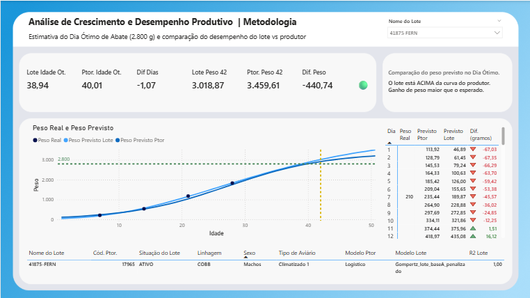

# 📊 Estimativa do Dia de Abate Ótimo

Projeto de modelagem estatística para ajuste de curvas de crescimento em frangos de corte, com objetivo de estimar a idade ótima de abate (2800g) e gerar indicadores comparativos utilizados em dashboard no Power BI.

---

## 📌 Contexto do Problema

Na produção avícola, a definição do momento ideal de abate impacta diretamente:

- 💰 Rentabilidade
- 📈 Eficiência produtiva
- 🏭 Planejamento operacional
- 📊 Comparação entre desempenho real vs produtor

Decisões imprecisas podem gerar perda de margem ou subaproveitamento do potencial produtivo.

Este projeto aplica modelos matemáticos sigmoides para estimar com precisão o ponto ótimo de abate com base em dados reais de peso por idade.

---

## 🎯 Objetivos do Projeto

- Ajustar curvas de crescimento por grupo (produtor/sexo/linhagem/aviário)
- Estimar idade para atingir 2800g
- Comparar peso real vs peso previsto
- Selecionar automaticamente o melhor modelo estatístico
- Gerar base estruturada para visualização analítica no Power BI

---

## 📈 Modelos de Crescimento Testados

- Gompertz  
- Logístico  
- Von Bertalanffy  
- Richards  

A seleção do modelo é feita automaticamente via:

**AIC – Akaike Information Criterion**

O modelo com menor AIC é escolhido como melhor ajuste.

---

## 🧠 Estratégia Estatística

- Ajuste utilizando `scipy.optimize.curve_fit`
- Definição de limites biológicos (assíntota entre 2000g e 6000g)
- Cálculo de R²
- Validação cruzada Leave-One-Out (LOOCV)
- Estratégia específica para grupos com poucos dados

---

## 📤 Saída Gerada

Arquivo consolidado contendo:

- Modelo escolhido
- Parâmetros estimados
- Idade estimada para 2800g
- Peso previsto vs real aos 42 dias
- Métricas estatísticas (R², LOOCV)

---

# 📊 Dashboard – Curvas de Crescimento

Os resultados do modelo alimentam um dashboard desenvolvido no Power BI para análise comparativa do desempenho produtivo.

---

## 🖼️ Visual do Dashboard

---

## 🚀 Tecnologias Utilizadas

- Python
- Pandas
- NumPy
- SciPy
- Power BI

---

Projeto desenvolvido como portfólio de análise de dados aplicada ao setor agroindustrial.
